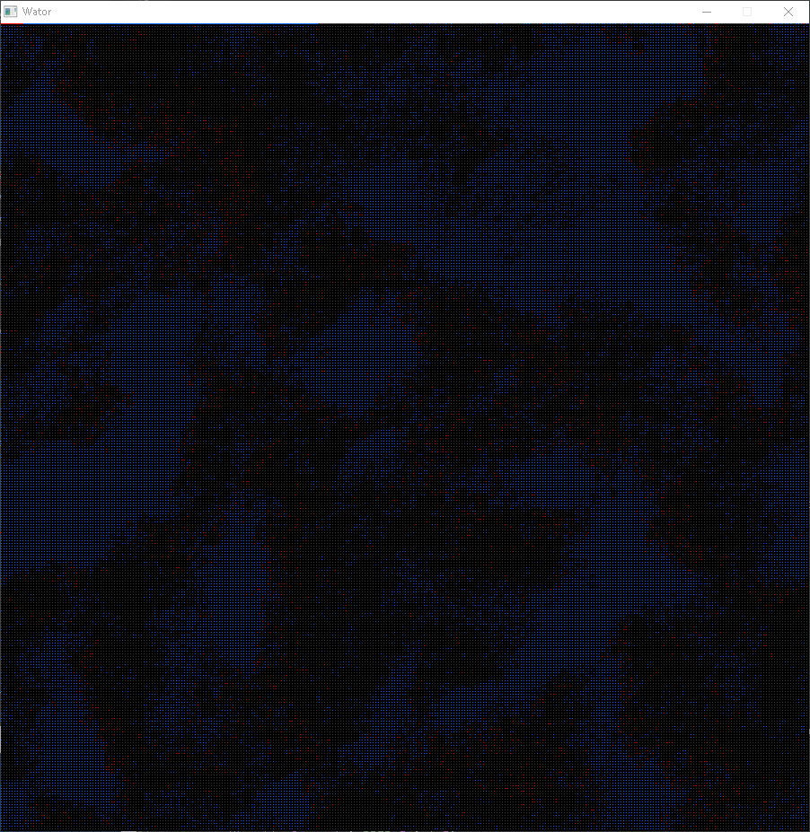

# COMPUTER RECREATIONS

### standard C99, USING SDL2, compiles under Linux and Windows using MinGW

includes reaction diffusion, euler spiral, fireworks simulation, forest fire cellular automata, fractal tree, gaussian distribution, three corps gravity simulation , hypnose a spinny blob , julia set, l-system tree, conway's game of life , two lissajous curves generators, three versions of the lorenz attractor, mandelbrot set, metaballs in black and white and in color, Munching Squares, perlin Noise, one lovely rosace, sierpinski triangle, two walkers simulation and the famous Dewdney wator simulation.

Enjoy !
 

