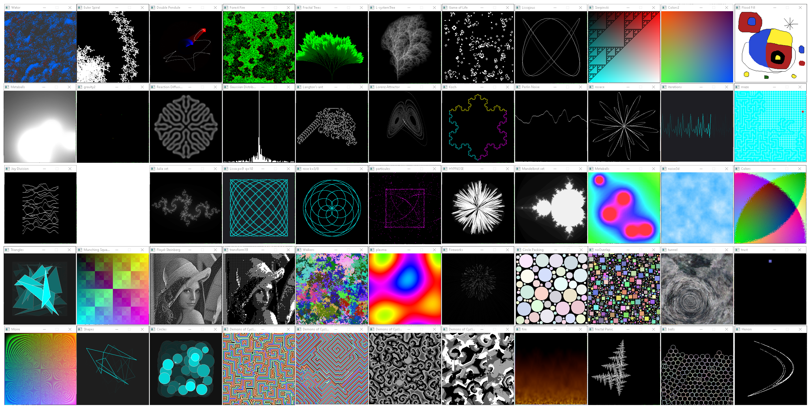

# COMPUTER RECREATIONS

### standard C99, using SDL2, compiles under Linux and Windows using MinGW

Includes reaction diffusion, euler spiral, fireworks simulation, forest fire cellular automata, fractal tree, gaussian distribution, three corps gravity simulation , hypnose (spinny blob), the Julia set, an l-system tree, Conway's game of life , the Langton's ant, two interactive Lissajous curves generators (read the sources to get the key maps), three versions of the lorenz attractor, Mandelbrot set, metaballs in black and white and in color, Munching Squares, Perlin noise (with a joy Division cover repro attempt), one lovely rosace generator, Sierpinski triangle, two walkers simulations, the famous Dewdney wator simulation and Demons Of Cyclic Space, circle packing and many other nice things...

Each source file is independant.

To compile, you can either use make or
* under windows :\
`gcc <source.c> -std=c99 -pedantic -Wpedantic -Wall -Werror -O3 -Wl,-subsystem,windows -lmingw32 -lSDL2main -lSDL2 -o <executable>`

* under linux :\
`gcc <source.c> -std=c99 -pedantic -Wpedantic -Wall -Werror -O3 -lSDL2 -o <executable>`

Enjoy !

